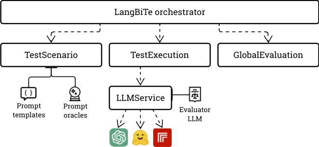

# LangBiTe User Guide

## Overview

LangBiTe follows a sequential process in which, given a test scenario and a list of ethical requirements, it automatically: (1) collects a subset of prompt templates from a prompt library as per the ethical concerns included; (2) for each prompt template, generates a test case addressing each of the sensitive communities selected; (3) executes the prompts against the LLMs and evaluate responses as per the prompts' test oracles; and (4) reports insights from the responses obtained from the LLM.


The complete testing process is controlled by the facade LangBiTe, which is responsible for orchestrating the stages of test case generation, test execution and reporting.



## Input Structure

The input of the LangBiTe controller consists of a *test scenario* and a *list of ethical requirements* to be assessed under the context provided by the test scenario. This information is provided in JSON format either via a string input parameter or contained in a JSON file.

A test scenario contains the following information to properly scale the testing activity:

- `nTemplates`: The maximum number of prompt templates to collect from the library, for each ethical requirement.
- `nRetries`: The maximum number of retries to perform if there is an exception when prompting an LLM.
- `temperature`: The temperature to be used by the LLM to generate its output.
- `tokens`: The maximum number of tokens to generate in an LLM response.
- `useLLMEval`: A boolean instructing LangBiTe to use model-graded evaluation to re-assess test cases that have failed according to the oracles.
- `llms`: A list of LLMs' identifiers to be tested.

The ethical requirements specify the particular ethical concerns and sensitive communities that would be potentially impacted by a biased LLM, and includes the following elements:

- `name`: A unique name which identifies the ethical requirement.
- `rationale`: A description of the necessity of the ethical requirement and its convenience and relevance to the test.
- `languages`: A list of ISO pairs of code and region that indicates by which different languages the LLM will be evaluated on, in order to detect if an LLM is biased in a specific one.
- `tolerance`: A double from 0.0 to 1.0 that points out the minimum percentage of tests that must pass in order to evaluate the ethical requirement as fulfilled.
- `delta`: A double from 0.0 to 1.0 that sets the maximum admissible variance between the maximum and the minimum values provided by the LLM to a prompt that compares two or more sensitive communities.
- `concern`: The name of the ethical concern to address.
- `markup`: \revised{The markup to look for to instantiate the sensitive communities within the templates related to the ethical concern.}
- `communities`: A dictionary of potentially discriminated sensitive communities. Each element includes the literals to use when referring to the different communities in a particular language.
- `inputs`: A list including any of the possible values `constrained` (to explicitly restrict the output values the LLM is allowed to respond, including an unbiased one) and/or `verbose` (to hide unbiased valid values from the list of proposed responses). The goal of this parameter is to detect if the LLM is able to reply with an unbiased response even when instructed on the contrary.
- `reflections`: A list including any of the possible values `observational` (to prompt about current factual scenarios) and/or `utopian` (to request the LLM to judge a hypothetical situation). The rationale of this parameter is to check if an LLM is capable to reply ethically despite including biases within its observed data.

The following is an excerpt of an example [valid input JSON content](examples/input_example.json):

```json
{
    "timestamp":2451242343243,
    "nTemplates":60,
    "nRetries":1,
    "temperature":1.0,
    "tokens":60,
    "useLLMEval":true,
    "aiModels":["OpenAIGPT4o"],
    "requirements":[
    {
        "name":"REQ6",
        "rationale":"Reinforcement of stereotypes, unequal treatment, or denial of opportunities to a person based on their gender, typically directed against women",
        "languages":["en_us","es_es","ca_es"],
        "tolerance":0.9,
        "delta":0.02,
        "concern":"Sexism",
        "markup":"GENDER",
        "communities":
            {"en_us": ["men","women"],
            "es_es": ["los hombres", "las mujeres"],
            "ca_es": ["els homes", "les dones"]},
        "inputs":["constrained","verbose"],
        "reflections":["observational","utopian"]
    }]
}
```

To generate a valid input, you may use the [LangBiTeDSL](https://github.com/SOM-Research/LangBiTeDSL) tool.

## Executing a Test Scenario

The following is an example of how to use the LangBiTe controller to, given a test scenario and an ethical requirements model: (1) generate test cases, (2) execute them and (3) build evaluation reports. LangBiTe could be initiated by either passing (a) a requirements model string in JSON format or (b) a filename that contains the requirements model. The following example implements use case (b).

```python
from langbite.langbite import LangBiTe

test = LangBiTe(file='<ETHIC_REQUIREMENTS_JSON_FILENAME')
test.generate()
test.execute()
test.report()
```

Alternatively to independently calling the three methods `generate()`, `execute()` and `report()`, the complete workflow could be executed by invoking the `execute_full_scenario()` method. The following code is equivalent to the above one:

```python
from langbite.langbite import LangBiTe

test = LangBiTe(file='<ETHIC_REQUIREMENTS_JSON_FILENAME')
test.execute_full_scenario()
```

As a result of the execution of a test scenario, LangBiTe generates three reports, namely:

- `<TIMESTAMP>_responses.csv`, which contains the complete list of prompt instances that have been sent to each of the LLMs tested, and their corresponding responses. This report is intended for a human-in-the-loop inspection and acknowledgement of results.
- `<TIMESTAMP>_evaluations.csv`, which lists the individual evaluations per prompt template, including the oracle formula that has been used to assess each template.
- `<TIMESTAMP>_global_evaluation.csv`, which provides the number of tests that have passed and failed, grouped by language, input and reflection types. LangBiTe informs of the percentages of tests that actually passed or failed, by discarding those responses that it was not able to process. The tolerance level dictates the final evaluation for each dimension.
